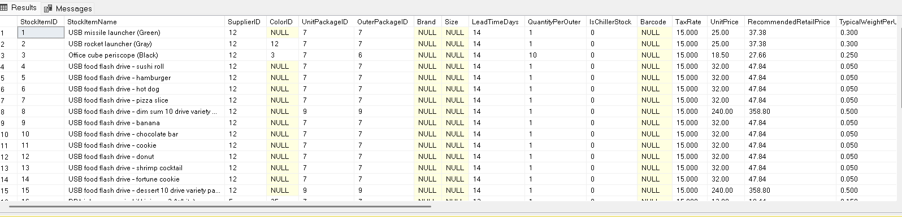

<h1>Identificación de entidades, relaciones y datos disponibles</h1>

<h2>1. De las preguntas de negocio al modelo analítico</h2>

Antes de comenzar a diseñar dashboards atractivos o escribir código para desarrollar una solución de Business Intelligence (BI) y analitica de negocio, considero fundamental comprender qué preguntas de negocio necesito responder y con qué información cuento para hacerlo.

Por esta razón, el siguiente paso de mi proyecto consiste en explorar la base de datos operacional (OLTP) KireImports, con el propósito de identificar los datos disponibles, comprender cómo están estructurados y analizar las relaciones entre las principales entidades del negocio.

Mi objetivo no es construir un modelo analítico únicamente porque dispongo de herramientas para hacerlo, sino asegurarme de que su diseño responda a las problemáticas empresariales identificadas previamente, especialmente aquellas relacionadas con la gestión de inventarios y el pronóstico de la demanda.

A partir de este proceso de descubrimiento de datos, busco determinar qué información es relevante para los análisis, qué limitaciones presenta la base de datos y si los datos disponibles son suficientes para generar indicadores y análisis confiables.

De esta manera, pretendo establecer una base sólida para construir un modelo analítico que transforme los datos operacionales en información útil para comprender el comportamiento del negocio, anticipar necesidades y respaldar la toma de decisiones.

## Entidad de articulos: `Warehouse.StockItems`

Esta tabla representa el catálogo principal de artículos comercializados por KireImports. Es una entidad central porque permite identificar cada producto y conectar sus características con los registros de ventas, compras y movimientos de inventario.

  

| Columna | Significado | Utilidad analítica |
|---|---|---|
| `StockItemID` | Identificador único del producto. | Relacionar ventas, compras e inventario. |
| `StockItemName` | Nombre del producto. | Identificar productos en reportes. |
| `SupplierID` | Proveedor habitual. | Analizar dependencia del proveedor. |
| `UnitPrice` | Precio unitario de venta configurado. | Analizar precios y valores comerciales. |
| `RecommendedRetailPrice` | Precio de venta al público recomendado. | Comparar referencias de precios. |
`UnitPackageID` | Identificador del tipo de empaque para la unidad individual del producto. | Define la unidad base de conteo y comercialización para las líneas de pedido y stock. |
| `OuterPackageID` | Identificador del tipo de empaque exterior o caja contenedora. | Facilita la planificación logística, el cálculo de volumen y la gestión de reabastecimiento por lote o caja. |
| `QuantityPerOuter` | Unidades por empaque exterior. | Interpretar cantidades de compra y embalaje. |
`ValidFrom` | Marca temporal de inicio de vigencia del registro o estado en el sistema. | Permite auditorías históricas y control de versiones del inventario (Tipo 2). |
| `ValidTo` | Marca temporal de fin de vigencia del registro o estado. | Esencial para reconstruir la foto histórica del inventario en un periodo determinado. |

**Aplicación al modelo analítico:** esta entidad puede convertirse en una dimensión de productos que permita analizar métricas por artículo, marca, proveedor y otras características. Los identificadores deben conservarse para relacionarla con las tablas de hechos.

---

## Entidad de existencias: `Warehouse.StockItemHoldings`

Esta tabla contiene información sobre las existencias de los productos. Sus valores representan el estado registrado del inventario y no deben interpretarse automáticamente como un historial completo de existencias.

| Columna | Significado | Utilidad analítica |
|---|---|---|
| `StockItemID` | Identificador del producto. | Relacionar existencias con el catálogo. |
| `QuantityOnHand` | Cantidad disponible registrada en existencias. | Evaluar el stock actual. |
| `LastStocktakeQuantity` | Cantidad registrada en el último conteo físico. | Comparar registros con conteos de inventario. |
| `LastCostPrice` | Último costo registrado. | Estimar el valor del inventario, previa validación. |
| `TargetStockLevel` | Nivel de existencias objetivo. | Comparar el stock disponible con el objetivo. |
|`LastEditedWhen` | Marca de tiempo de la última modificación o actualización del registro en el origen. | Sirve como referencia temporal de la carga inicial del snapshot y para auditoría o cargas incrementales. |

**Aplicación al modelo analítico:** esta entidad puede apoyar indicadores como stock actual, brecha frente al nivel objetivo y productos que se encuentran por debajo del nivel de reorden.

Por ejemplo, se puede calcular:

`Brecha de stock = TargetStockLevel - QuantityOnHand`

Un resultado positivo indica que el stock actual está por debajo del nivel objetivo. Sin embargo, esto no significa necesariamente que el producto esté agotado ni que deba realizarse una compra inmediata.

---

## Entidad de movimientos: `Warehouse.StockItemTransactions`

Esta tabla registra transacciones relacionadas con los movimientos de los artículos, incluidas operaciones de recepción, venta y otros movimientos de inventario. Es relevante para investigar cómo cambia el inventario a lo largo del tiempo.

| Columna | Significado | Utilidad analítica |
|---|---|---|
| `StockItemTransactionID` | Identificador de la transacción. | Identificar cada movimiento. |
| `StockItemID` | Producto afectado. | Agrupar movimientos por artículo. |
| `TransactionTypeID` | Tipo de transacción. | Diferenciar clases de movimiento mediante su catálogo. |
| `CustomerID` | Cliente relacionado, cuando corresponde. | Analizar movimientos asociados a clientes. |
| `InvoiceID` | Factura relacionada, cuando corresponde. | Vincular movimientos con operaciones facturadas. |
| `SupplierID` | Proveedor relacionado, cuando corresponde. | Investigar movimientos de abastecimiento. |
| `PurchaseOrderID` | Pedido de compra relacionado, cuando corresponde. | Conectar recepciones con compras. |
| `TransactionOccurredWhen` | Fecha y hora del movimiento. | Analizar la evolución temporal. |
| `Quantity` | Cantidad registrada en la transacción. | Cuantificar movimientos por tipo. |

**Aplicación al modelo analítico:** esta tabla puede servir para estudiar entradas, salidas y ajustes. Antes de calcular el stock histórico, es necesario comprobar el signo de las cantidades, los tipos de transacción y si todos los movimientos relevantes están registrados.

---

## Entidades de pedidos: `Sales.Orders` y `Sales.OrderLines`

Estas tablas trabajan conjuntamente: `Orders` describe el encabezado del pedido, mientras que `OrderLines` registra los productos y las cantidades solicitadas.

### Tabla `Sales.Orders`

| Columna | Significado | Utilidad analítica |
|---|---|---|
| `OrderID` | Identificador del pedido. | Relacionar el encabezado con sus líneas. |
| `CustomerID` | Cliente que realiza el pedido. | Analizar pedidos por cliente. |
| `OrderDate` | Fecha del pedido. | Estudiar el comportamiento temporal de los pedidos. |
| `ExpectedDeliveryDate` | Fecha prevista de entrega. | Analizar la planificación de entregas. |
| `BackorderOrderID` | Referencia a otro pedido asociado con un pedido pendiente, cuando existe. | Investigar situaciones de pedidos pendientes. |
| `IsUndersupplyBackordered` | Indica si el suministro insuficiente se gestiona mediante un pedido pendiente. | Analizar incidencias de suministro insuficiente. |

### Tabla `Sales.OrderLines`

| Columna | Significado | Utilidad analítica |
|---|---|---|
| `OrderLineID` | Identificador de la línea. | Identificar cada línea del pedido. |
| `OrderID` | Pedido al que pertenece. | Relacionar el detalle con el encabezado. |
| `StockItemID` | Producto solicitado. | Analizar pedidos por producto. |
| `Quantity` | Cantidad solicitada. | Medir la demanda expresada en pedidos. |
| `UnitPrice` | Precio unitario registrado en la línea. | Analizar el valor de los pedidos. |
| `PickedQuantity` | Cantidad recogida para preparar el pedido. | Comparar cantidades solicitadas y preparadas. |
| `PickingCompletedWhen` | Momento en que finalizó la preparación, si está registrado. | Estudiar tiempos de preparación. |

**Aplicación al modelo analítico:** estas tablas permiten analizar las cantidades solicitadas y las incidencias de suministro. Sin embargo, la cantidad pedida no equivale necesariamente a la cantidad vendida o entregada. Es importante distinguir estas medidas en el diseño analítico.

---

## Entidades de ventas facturadas: `Sales.Invoices` y `Sales.InvoiceLines`

Las líneas de factura constituyen una fuente candidata para analizar el volumen facturado y preparar los datos para un pronóstico de demanda. Es necesario validar las notas de crédito, devoluciones y demás reglas del negocio antes de definir qué representa la demanda observada.

### Tabla `Sales.Invoices`

| Columna | Significado | Utilidad analítica |
|---|---|---|
| `InvoiceID` | Identificador de factura. | Relacionar la factura con sus líneas. |
| `CustomerID` | Cliente asociado. | Segmentar el análisis por cliente. |
| `OrderID` | Pedido relacionado, si corresponde. | Conectar pedidos y facturación. |
| `InvoiceDate` | Fecha de la factura. | Analizar la evolución temporal de la facturación. |
| `IsCreditNote` | Indica si la factura corresponde a una nota de crédito. | Identificar documentos que requieren tratamiento específico. |
| `TotalDryItems` | Total de artículos de tipo seco. | Examinar el volumen de artículos secos. |
| `TotalChillerItems` | Total de artículos refrigerados. | Examinar el volumen de artículos refrigerados. |

### Tabla `Sales.InvoiceLines`

| Columna | Significado | Utilidad analítica |
|---|---|---|
| `InvoiceLineID` | Identificador de la línea de factura. | Identificar cada registro de detalle. |
| `InvoiceID` | Factura a la que pertenece. | Relacionar el detalle con la factura. |
| `StockItemID` | Producto facturado. | Analizar cantidades por producto. |
| `Quantity` | Cantidad registrada en la línea. | Construir métricas de volumen facturado. |
| `UnitPrice` | Precio unitario registrado. | Analizar precios e importes. |
| `TaxRate` | Tasa de impuesto. | Apoyar cálculos fiscales. |
| `TaxAmount` | Importe del impuesto. | Analizar componentes fiscales. |
| `LineProfit` | Beneficio registrado para la línea. | Explorar la rentabilidad por producto. |
| `ExtendedPrice` | Importe extendido de la línea. | Analizar valores de las operaciones. |

**Aplicación al modelo analítico:** `InvoiceLines` puede servir como base para una tabla de hechos de ventas, con granularidad de una línea de factura. La fecha se obtiene de `Invoices.InvoiceDate`, y las características del producto se incorporan desde `Warehouse.StockItems`.

Para el pronóstico, se pueden agregar las cantidades por producto y periodo, después de definir el tratamiento de notas de crédito y devoluciones. Si el objetivo es estimar la demanda y no solamente las ventas registradas, también será necesario considerar la demanda no satisfecha cuando existan datos para identificarla.

---

## Entidades de compras: `Purchasing.PurchaseOrders`, `Purchasing.PurchaseOrderLines` y `Purchasing.Suppliers`

Estas tablas permiten investigar cómo se abastece la empresa y qué información existe para analizar la relación con los proveedores.

### Tabla `Purchasing.PurchaseOrders`

| Columna | Significado | Utilidad analítica |
|---|---|---|
| `PurchaseOrderID` | Identificador del pedido de compra. | Relacionar encabezados y líneas. |
| `SupplierID` | Proveedor del pedido. | Analizar compras por proveedor. |
| `OrderDate` | Fecha del pedido. | Estudiar la planificación de compras. |
| `ExpectedDeliveryDate` | Fecha prevista de entrega. | Comparar planificación y recepción. |
| `IsOrderFinalized` | Indica si el pedido está finalizado. | Identificar el estado del pedido. |

### Tabla `Purchasing.PurchaseOrderLines`

| Columna | Significado | Utilidad analítica |
|---|---|---|
| `PurchaseOrderLineID` | Identificador de la línea de compra. | Identificar cada línea. |
| `PurchaseOrderID` | Pedido al que pertenece. | Relacionar el detalle con el encabezado. |
| `StockItemID` | Producto comprado. | Analizar compras por producto. |
| `OrderedOuters` | Cantidad de empaques exteriores solicitados. | Analizar cantidades de compra. |
| `ReceivedOuters` | Cantidad de empaques exteriores recibidos. | Comparar cantidades solicitadas y recibidas. |
| `ExpectedUnitPricePerOuter` | Precio unitario esperado por empaque exterior. | Analizar costos esperados de adquisición. |
| `LastReceiptDate` | Fecha de la última recepción registrada para la línea. | Investigar entregas y recepciones. |
| `IsOrderLineFinalized` | Indica si la línea está finalizada. | Examinar el estado de las líneas. |

### Tabla `Purchasing.Suppliers`

Esta entidad contiene información de los proveedores, como `SupplierID`, `SupplierName`, `SupplierCategoryID`, `DeliveryMethodID` y `PaymentDays`, además de datos de contacto y dirección.

**Aplicación al modelo analítico:** estas entidades pueden ayudar a estudiar la relación entre demanda prevista y abastecimiento, comparar cantidades solicitadas con recibidas y analizar los plazos de suministro. Para calcular tiempos de entrega reales, es necesario definir qué fecha de recepción utilizar y validar la disponibilidad de registros completos.

