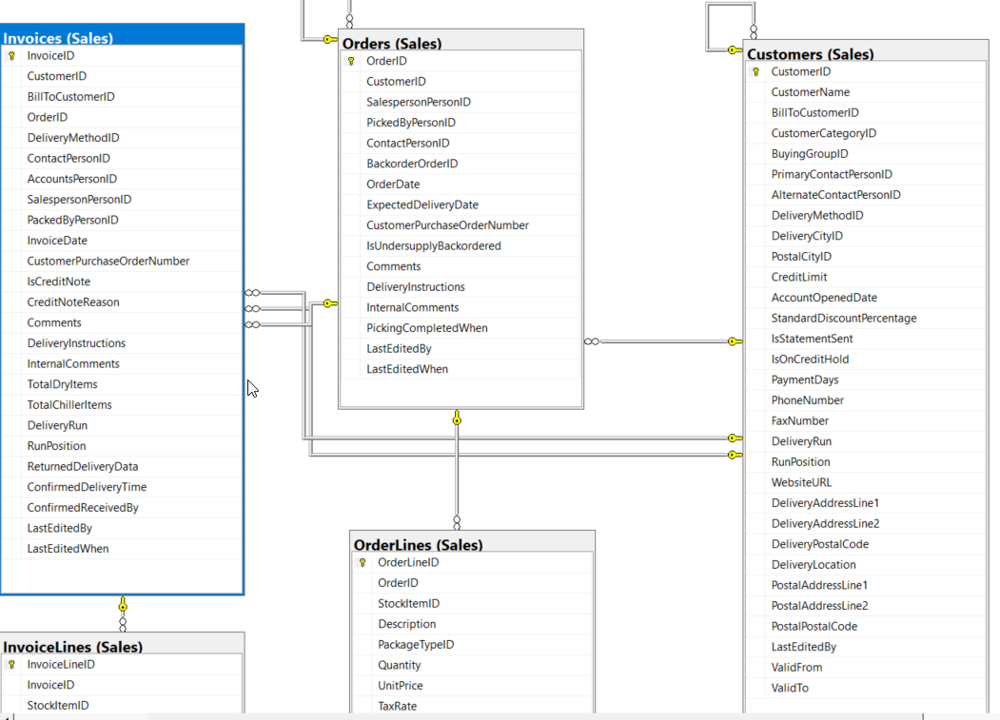

<h1>Identificación de la base operacional (OLTP)</h1>

<h3>1. Identificación y Origen de la Fuente</h3>
Para el desarrollo del proyecto se utilizó Wide World Importers como base de datos operacional. Esta corresponde a la base de datos de ejemplo oficial para Microsoft SQL Server (OLTP), la cual simula el entorno transaccional de una empresa mayorista de distribución de novedades y artículos de regalo a nivel internacional.

<h3>2. Contexto de Negocio y Operaciones</h3>
El modelo operacional almacena y gestiona de manera estructurada las actividades cotidianas del negocio, abarcando áreas críticas como:

-Ventas y Pedidos: Registro de transacciones con clientes mayoristas y minoristas.

-Gestión de Compras y Proveedores: Control de adquisición de mercancías.

-Gestión de Inventarios y Existencias: Niveles de stock, movimientos de almacén y existencias físicas.

-Estructura Organizacional: Información de empleados, sucursales y canales de distribución.

  

<h3>3. Características Técnicas del Entorno Origen</h3>

Plataforma de Base de Datos: Microsoft SQL Server.

Arquitectura: OLTP (Online Transaction Processing), optimizada para operaciones de inserción, actualización y consulta transaccional en tiempo real (normalizada a través de tablas transaccionales).

Volumen y Complejidad: Cuenta con esquemas relacionales robustos (principalmente bajo el esquema Sales, Purchasing, Warehouse, etc.), lo que la convierte en una fuente ideal para diseñar procesos de extracción, transformación y carga (ETL/ELT) hacia un entorno analítico (Data Warehouse).
